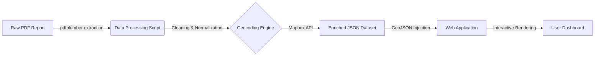

# Australia Laboratory Network Analysis & Visualization

## Executive Summary

This project delivers a robust end-to-end geospatial solution designed to extract, process, and visualize the national network of pathology collection centers across Australia. By automating the extraction of unstructured PDF reports and converting them into high-precision geospatial data, this system provides stakeholders with an interactive, web-based dashboard for strategic analysis.

The solution bridges the gap between raw administrative documents and actionable location intelligence, processing over **6,500 data points** with advanced geocoding techniques and rendering them on a high-performance interactive map.

---

## System Architecture

The project operates on a two-tier architecture:

1.  **Data Processing Engine (Python Backend)**: Handles the ingestion of PDF reports, text parsing, structural normalization, and high-volume geocoding.
2.  **Visualization Interface (Web Frontend)**: A modern, localized web application serving the processed geospatial data to end-users via an interactive Mapbox interface.



---

## 1. Data Processing Engine (`geopoints.py`)

The backend is a sophisticated Python pipeline engineered to handle the complexities of parsing disparate address formats and ensuring high success rates in geocoding.

### Key Capabilities

*   **PDF Parsing**: Utilizes `pdfplumber` to perform layout-aware text extraction. It dynamically identifies columns based on spatial coordinates (`x-axis bounds`), ensuring accurate segregation of fields like `APA Number`, `ACC Name`, and `Address` even when data spans multiple lines.
*   **Intelligent Record Merging**: Implements logic to detect and reconstruct multi-line records, ensuring no address fragments are lost during extraction.
*   **Advanced Geocoding Strategy**:
    *   The system employs a **multi-tier hierarchical fallback strategy** to maximize geocoding accuracy.
    *   **Tier 1**: Exact match (Address + Suburb + State + Postcode).
    *   **Tier 2**: Relaxed match (Address + Suburb + State).
    *   **Tier 3**: Locality match (Suburb + State + Postcode).
    *   **Tier 4**: Business Name match (Cleaning suffixes like "PTY LTD" to find the entity by name).
    *   **Tier 5**: Coarse granularity (Suburb or Postcode centroid).
*   **Performance Optimization**: Uses `concurrent.futures.ThreadPoolExecutor` to parallelize Mapbox API requests, significantly reducing the time required to process thousands of records.
*   **Caching Mechanism**: Implements runtime caching to prevent redundant API calls for duplicate addresses, preserving API quota and speed.

---

## 2. Interactive Visualization (`web_dist/`)

The frontend is a bespoke single-page application (SPA) focused on usability and performance.

### Key Features

*   **Mapbox GL JS Core**: Leverages WebGL for rendering thousands of vector points smoothly.
*   **Dynamic Clustering**: Implements `supercluster` logic to group collection centers at low zoom levels, decluttering the view and revealing density hotspots. Clusters dynamically break apart into individual points upon zooming.
*   **Secure Access**: Features a lightweight, overlay-based authentication system to protect sensitive data.
*   **Rich Information Cards**: When selecting a laboratory, users are presented with a detailed card styled similarly to Google Maps, displaying:
    *   Facility Name
    *   Full Address
    *   Operational Dates
    *   Laboratory ID
*   **Responsive Design**: Optimized for varied screen sizes, ensuring accessibility for mobile and desktop users.

---

## Technical Stack

### Backend
*   **Python 3.10+**
*   **PDF Extraction**: `pdfplumber`
*   **Geospatial Processing**: Mapbox Geocoding API v5
*   **Concurrency**: `concurrent.futures`

### Frontend
*   **Framework**: Vanilla JS (ES6+)
*   **Mapping Engine**: Mapbox GL JS v2.15
*   **Styling**: Custom CSS3 with responsive flexible layouts
*   **Data Transport**: GeoJSON / JSON

---

## Usage Guide

### Prerequisites
*   Python 3.x installed.
*   Mapbox API Access Token.
*   Modern Web Browser (Chrome, Edge, Firefox).

### Data Pipeline Execution
To update the dataset from a new PDF report:

1.  Place the new report in the project root as `APCCReport.pdf`.
2.  Run the processing script:
    ```bash
    python geopoints.py
    ```
3.  The script will generate an updated `labs_with_coordinates_improved.json`.

### Web Deployment
1.  Navigate to the `web_dist` directory.
2.  Open `index.html` via a local server (e.g., Live Server) or deploy to a static host (Netlify, Vercel).
3.  **Login Credentials**:
    *   **User**: `juan.mora@tbtbglobal.com`
    *   **Pass**: `1234567890`

---

## Directory Structure

```text
.
├── geopoints.py                # Main data processing & geocoding script
├── APCCReport.pdf              # Source data
├── labs_with_coordinates.json  # Processed output data
└── web_dist/                   # Web Visualization Bundle
    ├── index.html              # Application Entry Point
    ├── app.js                  # Frontend Application Logic
    ├── style.css               # Visual Styling
    └── README.md               # Documentation
```
